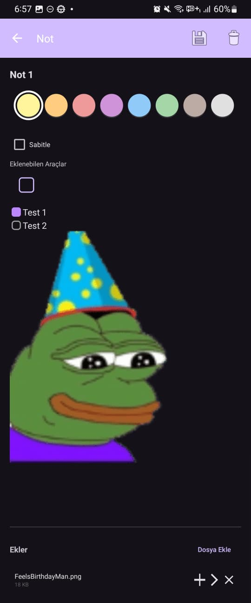
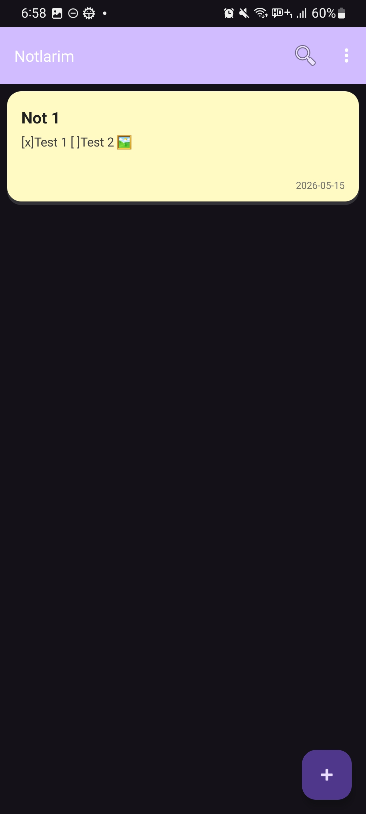
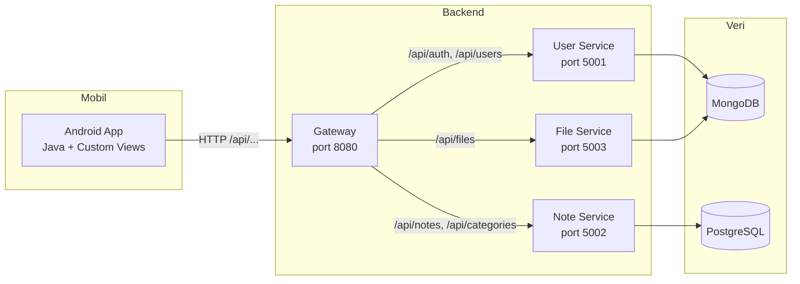
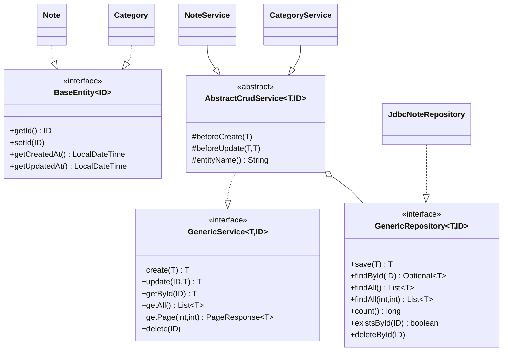
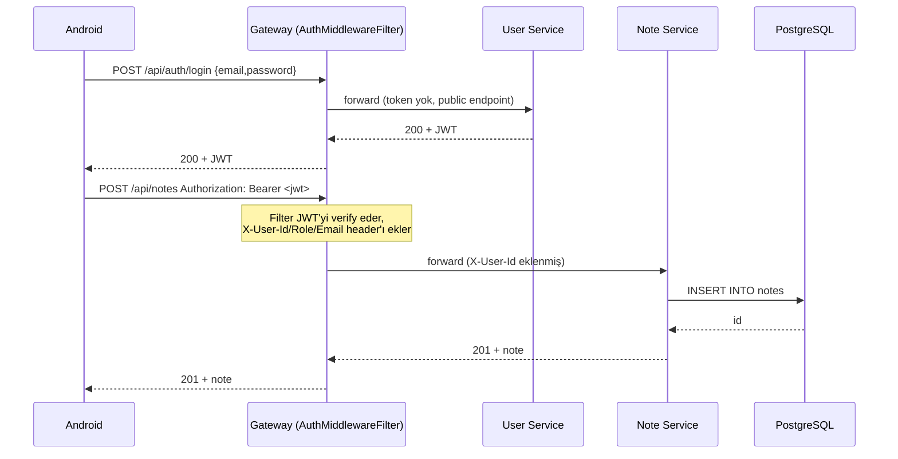

# Notlarım — Mobil Not Tutma Uygulaması

Kocaeli Üniversitesi **TBL324 İleri Java Uygulamaları** dersi dönem projesidir.
Spring Boot tabanlı mikroservis backend, PostgreSQL + MongoDB veri katmanı, Android (Java) mobil istemci ve Docker Compose ile tek komutla ayağa kalkan bir yığın sunar.

## İçindekiler
- [Özellikler](#özellikler)
- [Mobil Uygulama Görüntüleri](#mobil-uygulama-görüntüleri)
- [Mimari](#mimari)
- [Klasör Yapısı](#klasör-yapısı)
- [Hızlı Başlangıç](#hızlı-başlangıç)
- [API Uçları](#api-uçları)
- [Performans Testleri](#performans-testleri)
- [Geliştirme Notları](#geliştirme-notları)
- [Geliştiriciler](#geliştiriciler)

## Proje hakkında
Bu proje, kullanıcıların kayıt ve giriş işlemlerini gerçekleştirerek not oluşturabildiği, düzenleyebildiği, arayabildiği ve dosya ekleyebildiği bir Android mobil not tutma uygulamasıdır. Kullanıcılar sistem üzerinde güvenli bir şekilde hesap oluşturup oturum açar, notlarını kategorize ederek yönetir ve içeriklerine checkbox veya dosya referansları gibi zengin metin öğeleri ekler. Her kullanıcı yalnızca kendi oluşturduğu notlara ve yüklediği dosyalara erişir. Bu sayede diğer kullanıcıların verilere erişimi engellenir. Tüm sistem hızlıca kurulup çalıştırılmaya hazır bir altyapıya sahiptir.

## Özellikler

- **Kayıt / Giriş**: BCrypt ile parola özetleme, JWT (jjwt 0.11.5) ile oturum. Gateway'deki `AuthMiddlewareFilter` token'ı çözer ve `X-User-Id`/`X-User-Role`/`X-User-Email` başlıklarını aşağı servislere geçirir. İstemcinin spoof etmesini engellemek için bu başlıklar gelen istekten önce silinir.
- **Not yönetimi**: Oluştur, listele (sayfalı), arama (başlık / içerik / tüm alanlar), kategori filtresi, sabitleme, silme.
- **Markup içerik**: Notun içeriği düz metin, checkbox (`[checkbox,0]` / `[checkbox,1]`) ve dosya referansı (`[image:id]`) içerebilir.
- **Kategori yönetimi**: Kullanıcı bazlı kategori CRUD.
- **Dosya yönetimi**: MongoDB GridFS üzerinden ek dosya yükleme / indirme.
- **API Gateway**: Tek giriş noktası. İstekleri ilgili servise yönlendirir, hata vakalarında uygun HTTP kodu döner.
- **Mobil**: Android, Java. Custom Graphics içeren `NoteCardView` (Canvas + Paint ile çizilmiş kart) ve `ColorPaletteView` (özel çizim renk seçici).
- **Docker**: `docker compose up --build` ile PostgreSQL + MongoDB + 4 servis tek komutta çalışır.
- **Performans**: k6 ile smoke / load / stress senaryoları.

## Mobil Uygulama Görüntüleri

<details>
    <summary>Görüntüleri göster / gizle</summary>
    <p align="center">
        
        
    </p>
</details>

## Mimari







## Klasör Yapısı

```
note-app/
├── backend/
│   ├── pom.xml                       # Multi-module parent
│   ├── apps/
│   │   ├── gateway-service/          # Reverse proxy + AuthGuard health
│   │   ├── user-service/             # Mongo + BCrypt + auth
│   │   ├── note-service/             # PostgreSQL + JDBC + Strategy/Factory
│   │   └── file-service/             # MongoDB GridFS
│   └── utils/
│       └── common-utils/             # Generic<T>, exception handler, AuthGuard
├── frontend/                         # Android (Java) uygulaması
├── load-tests/                       # k6 senaryoları
├── docs/                             # Mimari, API, performans raporu
└── docker-compose.yml
```

## Hızlı Başlangıç

### Gereksinimler
- Docker + Docker Compose
- Android Studio (mobil için, isteğe bağlı)
- (Yerel geliştirme için) JDK 17+, Maven 3.9+

### Tek komutta ayağa kaldır
```bash
docker compose up --build
```

Ardından:
- Gateway (host): http://localhost:8080
- User Service (container network): http://user-service:5001
- Note Service (container network): http://note-service:5002
- File Service (container network): http://file-service:5003
- PostgreSQL (container network): postgres:5432
- MongoDB (container network): mongo:27017


### Yerel Geliştirme (Maven)
```bash
cd backend
./mvnw clean install -DskipTests
./mvnw -pl apps/note-service spring-boot:run
```

### Android
Android Studio ile `frontend/` klasörünü açın. Gateway adresini `frontend/local.properties` içine `BASE_URL=...` olarak yazın (ör. emülatör için `http://10.0.2.2:8080`, gerçek telefonda PC'nin LAN IP'si). Bu değer build sırasında `BuildConfig.BASE_URL` olarak üretilir ve uygulama `AppContext.BASE_URL` üzerinden kullanır.

## API Uçları

Tam liste için bkz. [docs/API.md](docs/API.md).

| Yöntem | Yol | Açıklama |
|---|---|---|
| POST | `/api/auth/register` | Kayıt |
| POST | `/api/auth/login` | Giriş |
| GET | `/api/users` | Kullanıcıları listele (yalnızca `ADMIN`) |
| GET | `/api/users/me` | Kendi profilim |
| GET | `/api/users/{id}` | Kullanıcı detayı |
| PUT | `/api/users/{id}` | Profil güncelle |
| DELETE | `/api/users/{id}` | Hesap sil |
| GET | `/api/notes` | Sayfalı liste |
| POST | `/api/notes` | Not oluştur |
| GET | `/api/notes/{id}` | Detay |
| GET | `/api/notes/{id}/parsed` | İçeriği parse edilmiş node listesi |
| PUT | `/api/notes/{id}` | Güncelle |
| DELETE | `/api/notes/{id}` | Sil |
| GET | `/api/notes/search?type=&q=` | Arama (title / content / all) |
| GET | `/api/notes/pinned` | Sabitlenmiş notlar |
| GET | `/api/notes/category/{categoryId}` | Kategoriye göre liste |
| POST | `/api/notes/{id}/toggle-pin` | Sabitle/çöz |
| GET | `/api/categories` | Kategorileri listele |
| POST | `/api/categories` | Kategori oluştur |
| PUT | `/api/categories/{id}` | Kategori güncelle |
| DELETE | `/api/categories/{id}` | Kategori sil |
| POST | `/api/files` | Dosya yükle (multipart) |
| GET | `/api/files` | Dosya listele (opsiyonel `noteId`) |
| GET | `/api/files/{id}` | Dosya metadata |
| GET | `/api/files/{id}/download` | İndir |
| DELETE | `/api/files/{id}` | Dosya sil |

## Performans Testleri

```bash
docker compose up -d
k6 run load-tests/smoke.js
k6 run load-tests/load.js
k6 run load-tests/stress.js
```

Eşik değerler ve örnek sonuçlar [docs/PERFORMANCE.md](docs/PERFORMANCE.md) içindedir.

## Geliştirme Notları

- Generic CRUD iskeleti `common-utils/generic` altında (`BaseEntity`, `GenericRepository`, `AbstractCrudService`, `PageResponse`, `ApiResponse`). Note ve Category bunun üstüne kuruluyor.
- JDBC ve NoSQL farklı servislerin sorumluluğunda: note-service PostgreSQL + JdbcTemplate, user/file servisleri Mongo.
- Servis-arayüz ayrımı var (`INoteService`/`NoteService` gibi), constructor injection ile bağımlılık veriliyor.
- Arama için Strategy + Factory deseni, ortak CRUD için Template Method deseni, yetki için AOP aspect kullanıldı.
- Hatalar `common-utils/exception/GlobalExceptionHandler` üzerinden tek noktadan HTTP koduna eşleniyor.
- `NoteCardView` ve `ColorPaletteView` Android View'dan türeyip onDraw içinde Canvas ile çiziliyor; standart bileşen kullanılmadı.

## Geliştiriciler

- Ahmet Tahsin Söylemez — 211307040
- Erkan Hazır — 221307003
