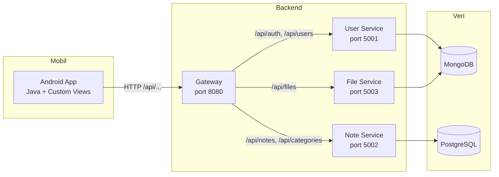
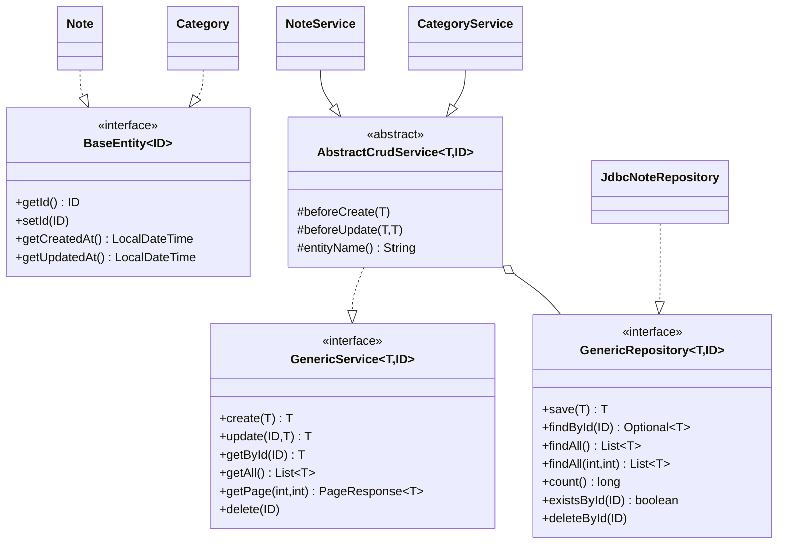
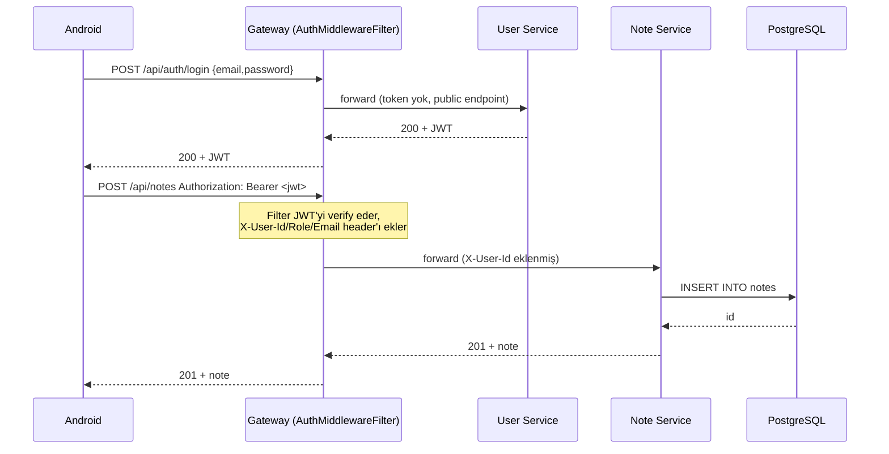

# Notlarım — Mobil Not Tutma Uygulaması

Kocaeli Üniversitesi **TBL324 İleri Java Uygulamaları** dersi dönem projesidir.
Spring Boot tabanlı mikroservis backend, PostgreSQL + MongoDB veri katmanı, Android (Java) mobil istemci ve Docker Compose ile tek komutla ayağa kalkan bir yığın sunar.

## İçindekiler
- [Özellikler](#özellikler)
- [Mimari](#mimari)
- [Klasör Yapısı](#klasör-yapısı)
- [Hızlı Başlangıç](#hızlı-başlangıç)
- [API Uçları](#api-uçları)
- [Performans Testleri](#performans-testleri)
- [Geliştirme Notları](#geliştirme-notları)
- [Geliştiriciler](#geliştiriciler)

## Özellikler

- **Kayıt / Giriş**: BCrypt ile parola özetleme, JWT (jjwt 0.11.5) ile oturum. Gateway'deki `AuthMiddlewareFilter` token'ı çözer ve `X-User-Id`/`X-User-Role`/`X-User-Email` başlıklarını aşağı servislere geçirir. İstemcinin spoof etmesini engellemek için bu başlıklar gelen istekten önce silinir.
- **Not yönetimi**: Oluştur, listele (sayfalı), arama (başlık / içerik / tüm alanlar), kategori filtresi, sabitleme, silme.
- **Kategori yönetimi**: Kullanıcı bazlı kategori CRUD.
- **Dosya yönetimi**: MongoDB GridFS üzerinden ek dosya yükleme / indirme.
- **API Gateway**: Tek giriş noktası (8080). İstekleri ilgili servise yönlendirir, hata vakalarında uygun HTTP kodu döner.
- **Mobil**: Android, Java. Custom Graphics içeren `NoteCardView` (Canvas + Paint ile çizilmiş kart) ve `ColorPaletteView` (özel çizim renk seçici).
- **Docker**: `docker compose up --build` ile PostgreSQL + MongoDB + 4 servis tek komutta çalışır.
- **Performans**: k6 ile smoke / load / stress senaryoları.

## Mimari







## Klasör Yapısı

```
note-app/
├── backend/
│   ├── pom.xml                       # Multi-module parent
│   ├── apps/
│   │   ├── gateway-service/          # Reverse proxy + AuthGuard health
│   │   ├── user-service/             # Mongo + BCrypt + auth
│   │   ├── note-service/             # PostgreSQL + JDBC + Strategy/Factory
│   │   └── file-service/             # MongoDB GridFS
│   └── utils/
│       └── common-utils/             # Generic<T>, exception handler, AuthGuard
├── frontend/                         # Android (Java) uygulaması
├── load-tests/                       # k6 senaryoları
├── docs/                             # Mimari, API, performans raporu
└── docker-compose.yml
```

## Hızlı Başlangıç

### Gereksinimler
- Docker + Docker Compose
- Android Studio (mobil için, isteğe bağlı)
- (Yerel geliştirme için) JDK 17+, Maven 3.9+

### Tek komutta ayağa kaldır
```bash
docker compose up --build
```

Ardından:
- Gateway: http://localhost:8080
- User Service: http://localhost:5001
- Note Service: http://localhost:5002
- File Service: http://localhost:5003
- PostgreSQL: localhost:5432
- MongoDB: localhost:27017

### Yerel Geliştirme (Maven)
```bash
cd backend
./mvnw clean install -DskipTests
./mvnw -pl apps/note-service spring-boot:run
```

### Android (Emulator)
Android Studio ile `frontend/` klasörünü açın. Emülatörden host makineye `10.0.2.2` üzerinden ulaşılır; `AppContext.BASE_URL` zaten bunu kullanır.

## API Uçları

Tam liste için bkz. [docs/API.md](docs/API.md).

| Yöntem | Yol | Açıklama |
|---|---|---|
| POST | `/api/auth/register` | Kayıt |
| POST | `/api/auth/login` | Giriş |
| GET | `/api/users/me` | Kendi profilim |
| PUT | `/api/users/{id}` | Profil güncelle |
| DELETE | `/api/users/{id}` | Hesap sil |
| GET | `/api/notes` | Sayfalı liste |
| POST | `/api/notes` | Not oluştur |
| GET | `/api/notes/{id}` | Detay |
| PUT | `/api/notes/{id}` | Güncelle |
| DELETE | `/api/notes/{id}` | Sil |
| GET | `/api/notes/search?type=&q=` | Arama (title / content / all) |
| GET | `/api/notes/pinned` | Sabitlenmiş notlar |
| POST | `/api/notes/{id}/toggle-pin` | Sabitle/çöz |
| GET | `/api/categories` | Kategorileri listele |
| POST | `/api/categories` | Kategori oluştur |
| POST | `/api/files` | Dosya yükle (multipart) |
| GET | `/api/files/{id}/download` | İndir |

## Performans Testleri

```bash
docker compose up -d
k6 run load-tests/smoke.js
k6 run load-tests/load.js
k6 run load-tests/stress.js
```

Eşik değerler ve örnek sonuçlar [docs/PERFORMANCE.md](docs/PERFORMANCE.md) içindedir.

## Geliştirme Notları

- **Generic<T>**: `common-utils` altındaki `BaseEntity<ID>`, `GenericRepository<T,ID>`, `GenericService<T,ID>`, `AbstractCrudService<T,ID>`, `PageResponse<T>` ve `ApiResponse<T>` tüm domain sınıflarında ortak tip güvenli bir CRUD iskeleti sağlar.
- **JDBC + NoSQL izole**: `note-service` PostgreSQL + JdbcTemplate kullanır; `user-service` ve `file-service` MongoDB ile çalışır. İkisi farklı modüller olarak ayrılmıştır.
- **SOLID**: Her servis interface'lerle bağımlılık inversiyonu kullanır (`INoteService`, `INoteRepository`, `IUserService`...). Service'ler constructor injection ile bağımlılık alır.
- **Design Patterns**:
  - *Strategy*: `SearchStrategy` (`TitleSearchStrategy`, `ContentSearchStrategy`, `AllFieldsSearchStrategy`) — arama davranışını çalışma zamanında seçer.
  - *Factory*: `SearchStrategyFactory` — istemcinin verdiği `type` parametresine göre uygun stratejiyi döndürür.
  - *Template Method*: `AbstractCrudService` — `beforeCreate` / `beforeUpdate` hook'larıyla alt sınıflar davranışı özelleştirir.
  - *Repository Pattern*: Veri erişimi ayrı bir katmanda izole edilmiştir.
- **Hata yönetimi**: `common-utils/exception/GlobalExceptionHandler` her istisnayı uygun HTTP koduna eşler (`400`, `401`, `403`, `404`, `503`, `504`). Validation hataları `@RestControllerAdvice` ile yakalanır.
- **Custom Graphics**: `NoteCardView` ve `ColorPaletteView` `View`'dan türeyip `onDraw` içinde `Canvas` + `Paint` API'si ile elle çizilir. Standart bileşen kullanılmamıştır.

## Geliştiriciler

- Ahmet Tahsin Söylemez — 211307040
- Erkan Hazır — 221307003
