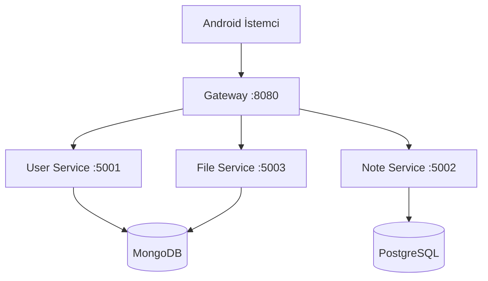

# Mimari Dokümanı

## Genel Bakış

Sistem 4 mikroservis + 2 veritabanı + 1 Android istemciden oluşur. Tüm istekler Gateway üzerinden geçer; istemci hangi servisin nerede olduğunu bilmek zorunda değildir.



## Servis Sorumlulukları

### Gateway Service (5000 / dış 8080)
- **AuthMiddlewareFilter** (`OncePerRequestFilter`, HIGHEST_PRECEDENCE):
  1. İstekten `X-User-*` başlıklarını siler (spoofing engeli).
  2. `Authorization: Bearer <jwt>` varsa `JWTService.verifyAndDecode` ile doğrular, başarısızsa `401`.
  3. Geçerliyse `X-User-Id`, `X-User-Role`, `X-User-Email` başlıklarını isteğe ekler.
- **MutableHttpServletRequest** wrapper'ı header değiştirilebilir kılar (Servlet API yalnız okumaya izin verir).
- **ProxyController** filter'dan sonra çalışır: `ServiceRegistry`'den hedef servisi bulur, RestTemplate ile forward eder.
- Eşleşmeyen yola `404`, hedef ulaşılamazsa `503` döner.
- Routing tablosu: `/api/auth/**`, `/api/users/**` → user-service · `/api/notes/**`, `/api/categories/**` → note-service · `/api/files/**` → file-service.

### User Service (5001)
- MongoDB üzerinde `users` koleksiyonu.
- BCrypt ile parola özetleme (`CryptoConfig` + `CryptoService`).
- JWT üretim (`JWTService`, jjwt 0.11.5, HS256 imza, 24 saat geçerlilik).
- `/api/auth/register`, `/api/auth/login` JWT döner; `/api/users/me`, `/api/users/{id}` için aşağı servisler gateway'in eklediği `X-User-Id`'i okur.
- `SecurityConfig` Spring Security'i stateless tutar; CSRF kapalı; tüm istekler `permitAll` (gerçek kontrol gateway + AuthGuard üzerinde).

### Note Service (5002)
- **PostgreSQL + JdbcTemplate**. ORM kullanılmaz; `RowMapper` ile manuel eşleme yapılır.
- `notes` ve `categories` tabloları kullanıcı kimliğine (string) göre indekslenir.
- `Strategy` deseni ile başlık / içerik / tüm alan araması.
- `Factory` ile istemcinin verdiği `type` parametresine göre stratejiyi seçer.
- `AbstractCrudService` üzerinden `Template Method` deseni: `beforeCreate`, `beforeUpdate` hook'ları.

### File Service (5003)
- MongoDB GridFS üzerinden büyük binary dosya saklanır.
- Dosyaya kullanıcı kimliği `metadata.userId` olarak yazılır; download/silme öncesi sahiplik kontrolü yapılır (`ForbiddenException` aksi halde).

## Veri Katmanı İzolasyonu

| Servis | Sürücü | Veritabanı | Tip |
|---|---|---|---|
| user-service | spring-boot-starter-data-mongodb | `user_service` | Doc store |
| file-service | spring-boot-starter-data-mongodb (GridFsTemplate) | `file_service` | Doc + binary |
| note-service | spring-boot-starter-jdbc + postgresql | `notes_db` | Relational |

İki farklı veritabanı motoru farklı servislerin sorumluluğundadır; bir servisin DB'si değiştiğinde diğeri etkilenmez.

## OOP / SOLID Haritası

| Prensip | Nerede |
|---|---|
| **S**RP | Her servis tek alana sahip; controller yalnızca HTTP, service iş mantığı, repository veri erişimi. |
| **O**CP | `AbstractCrudService` hook'ları override edilerek genişletilir; sınıf değiştirilmez. `SearchStrategy` arayüzü yeni stratejilerle genişler. |
| **L**SP | `JdbcNoteRepository` `INoteRepository`'nin yerine geçer; controller test için sahte repository ile çalışabilir. |
| **I**SP | `INoteRepository`, `ICategoryRepository`, `IFileService` ayrı; gateway sadece `ServiceRegistry`'i bilir. |
| **D**IP | Controller `IUserService` interface'ine bağımlıdır, `UserService` implementasyonuna değil. Constructor injection. |

## Kullanılan Tasarım Desenleri

- **Repository Pattern** — `JdbcNoteRepository`, `JdbcCategoryRepository`.
- **Strategy** — `SearchStrategy` ve 3 implementasyon.
- **Factory** — `SearchStrategyFactory` strategy seçer.
- **Template Method** — `AbstractCrudService.create` içindeki `beforeCreate / afterCreate` çağrıları.
- **Aspect (AOP)** — `AuthGuardAspect` rol tabanlı erişim kontrolünü deklaratif yapar.
- **Adapter (Android)** — `NoteAdapter` `RecyclerView` ile `NoteCardView`'i bağlar.

## Hata Yönetimi

`common-utils/exception/GlobalExceptionHandler` her servis tarafından `META-INF/spring/...AutoConfiguration.imports` üzerinden otomatik olarak yüklenir.

| İstisna | HTTP Kod |
|---|---|
| `BadRequestException` | 400 |
| `UnauthorizedException` | 401 |
| `ForbiddenException` | 403 |
| `NotFoundException` | 404 |
| `InternalServerException` | 500 |
| `ServiceUnavailableException` | 503 |
| `GatewayTimeoutException` | 504 |
| `MethodArgumentNotValidException` (validation) | 400 + alan hataları |

Tüm hata gövdeleri `{ timestamp, status, error, message }` standart formatındadır.

## Generic<T> Altyapısı

```java
// common-utils
interface BaseEntity<ID> { ID getId(); ... }
interface GenericRepository<T extends BaseEntity<ID>, ID> { T save(T); ... }
interface GenericService<T extends BaseEntity<ID>, ID> { T create(T); ... }
abstract class AbstractCrudService<T extends BaseEntity<ID>, ID> implements GenericService<T, ID> { ... }
class PageResponse<T> { ... }
class ApiResponse<T> { ... }
```

`Note` ve `Category` aynı temele oturur; `NoteService` ve `CategoryService` `AbstractCrudService<Entity, Long>` türünden somutlaştırılır.
