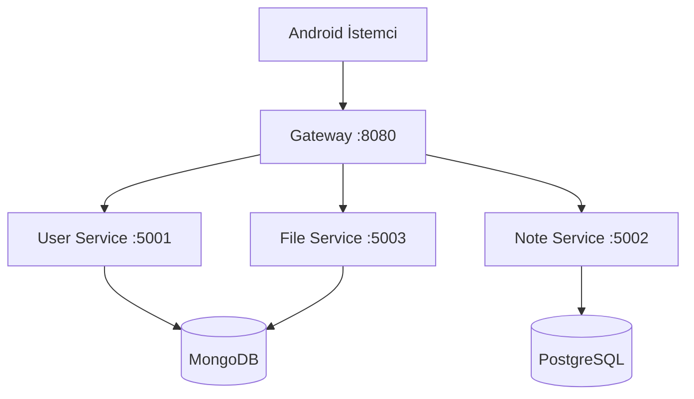

# Mimari

Sistem 4 mikroservis, iki veritabanı ve bir Android istemciden oluşuyor. Tüm istekler gateway üzerinden geçtiği için istemcinin tek bilmesi gereken adres var (`http://host:8080`).

## Servisler

**Gateway (5000 / dış 8080).** İstek geldiğinde önce `AuthMiddlewareFilter` çalışıyor: `Authorization: Bearer <jwt>` başlığı varsa doğruluyor, geçerliyse kullanıcı bilgisini `X-User-Id`/`X-User-Role`/`X-User-Email` başlıklarına dönüştürüyor. Sonra `ProxyController` yola göre hedef servisi seçip RestTemplate ile forward ediyor.

**User Service (5001).** MongoDB'de `users` koleksiyonu. BCrypt ile parola özetleme, jjwt 0.11.5 ile JWT üretimi (HS256, 24 saat). `/api/auth/register` ve `/api/auth/login` JWT döner.

**Note Service (5002).** PostgreSQL üzerinde `notes` ve `categories` tabloları. ORM kullanılmıyor; `JdbcTemplate` + manuel SQL + `RowMapper`. Arama için Strategy deseni (TitleSearchStrategy, ContentSearchStrategy, AllFieldsSearchStrategy) ve istek tipine göre stratejiyi seçen Factory var. CRUD ortak iş mantığı `AbstractCrudService<T,Long>` üzerinden (Template Method).

**File Service (5003).** MongoDB GridFS ile dosya yükleme/indirme. Yüklenen her dosyanın metadata'sına `userId` yazılıyor, başkası indirip silemiyor.

## Veri Katmanı

| Servis | Sürücü | Veritabanı | Tip |
|---|---|---|---|
| user-service | spring-data-mongodb | `user_service` | document |
| file-service | spring-data-mongodb (GridFsTemplate) | `file_service` | doc + binary |
| note-service | spring-jdbc + postgresql | `notes_db` | relational |

JDBC ve NoSQL ayrı servislerin sorumluluğunda. Bir veritabanı motoru değişirse diğer servisler etkilenmiyor.

## Generic Yapı

Ortak iskelet `common-utils/generic` altında:
- `BaseEntity<ID>` — id ve tarih alanları için arayüz
- `GenericRepository<T extends BaseEntity<ID>, ID>` — CRUD arayüzü
- `GenericService<T,ID>` ve `AbstractCrudService<T,ID>` — servis temel sınıfı
- `PageResponse<T>` — sayfalı liste yanıtı
- `ApiResponse<T>` — standart başarı yanıtı

`Note` ve `Category` bu yapıyı kullanıyor; `NoteService` ve `CategoryService` `AbstractCrudService`'den extend ediyor.

## Hata Yönetimi

`common-utils/exception/GlobalExceptionHandler` her servisin sınıfyolu üzerinden otomatik yükleniyor.

| İstisna | HTTP |
|---|---|
| `BadRequestException` | 400 |
| `UnauthorizedException` | 401 |
| `ForbiddenException` | 403 |
| `NotFoundException` | 404 |
| `ConflictException` | 409 |
| `InternalServerException` | 500 |
| `ServiceUnavailableException` | 503 |
| `GatewayTimeoutException` | 504 |
| Validation (alan hataları) | 400 |

Yanıt gövdesi: `{ timestamp, status, error, message }`. Validation hatalarında ek olarak `fields` alanı dönüyor.

## Yetki

Her korumalı endpoint başında `@AuthGuard(UserRoles.USER)` ya da `@AuthGuard(UserRoles.ADMIN)` annotation'ı var. `AuthGuardAspect` (AOP) request başlıklarını kontrol ediyor, başlık yoksa BadRequest, rol uymuyorsa Unauthorized fırlatıyor. Gerçek JWT doğrulaması zaten gateway'de yapıldığı için downstream servisler sadece header güveniyor.
